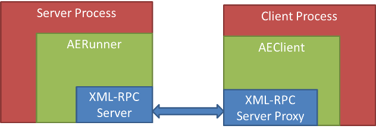
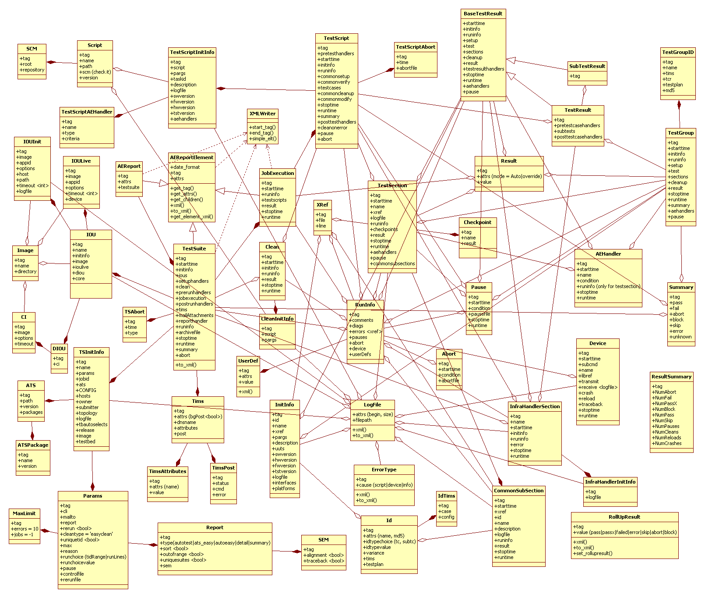

.. _aereport:

=================
AEReport Reporter
=================

This section explains the purpose of having AEReport, and provides a usage
tutorial. For more details, refer to the API Reference.

Introduction
============

AEReport is a package for collecting and generating test reports in XML formats,
similar to JUnit. 

As of now, two XML files are generated for each run (test suite execution):

#. *ResultsSummary.xml* (contains summary of results - test pass/fail/etc)

#. *ResultsDetails.xml* (contains all details of execution, timers, checkpoints, results, etc)

A sample ResultsSummary.xml file looks like this:

::

    <?xml version="1.0" ?>
    <jobSummary archiveFilename="atseasy/jeaubin/archive/14-06/run_jb.2014Jun02_10:12:00.zip" atsTreePath="/ws/jeaubin-ott/py">
       <jobName>run_jb</jobName>
       <image>TEMP</image>
       <aborted>0</aborted>
       <passed>0</passed>
       <failed>1</failed>
       <blocked>0</blocked>
       <skipped>2</skipped>
       <errored>0</errored>
       <unknown>0</unknown>
       <starttime>2014-06-02T10:12:01</starttime>
       <stoptime>2014-06-02T10:12:03</stoptime>
       <runtime>00:00:02</runtime>
       <testbed/>
       <release/>
       <submitter>jeaubin</submitter>
       <debugProfile>0</debugProfile>
       <host>jeaubin-dev</host>
    </jobSummary>

and here is an excerpt of ResultsDetails.xml:

::

    <?xml version="1.0" ?>
    <aereport xmlns:xsi="http://www.w3.org/2001/XMLSchema-instance">
     <testsuite>
      <starttime>2014-06-02T10:12:01</starttime>
      <initinfo>
       <name>run_jb</name>
       <ats>
        <path>/ws/jeaubin-ott/py</path>
        <version>5.3.0</version>
       </ats>
      </initinfo>
      <jobexecution>
       <runinfo/>
       <starttime>2014-06-02T10:12:01</starttime>
       <stoptime>2014-06-02T10:12:03</stoptime>
       <result mode="auto"/>
       <testscript>
        <starttime>2014-06-02T10:12:01</starttime>
        <initinfo>
            ...
        <runinfo/>
        <testcase>
         <starttime>2014-06-02T10:12:03</starttime>
         <stoptime>2014-06-02T10:12:03</stoptime>
         <result mode="auto">skipped</result><runtime>00:00:00</runtime>
        </testcase>
        <stoptime>2014-06-02T10:12:03</stoptime>
        <runtime>00:00:02</runtime>
        

         <abort>0</abort>
         <fail>0</fail>
         <block>0</block>
         <skip>0</skip>
         <error>0</error>
         <unknown>0</unknown>
        

        <pass>0</pass>
       </testscript>
       <runtime>00:00:02</runtime>
       ...
      </jobexecution>
      <tims bgPost="False">
       <post>
        <status/>
        <cmd/>
       </post>
       <dnsname/>
      </tims>
      <runinfo/>
      <archivefile>atseasy/jeaubin/archive/14-06/run_jb.2014Jun02_10:12:00.zip</archivefile>
      <stoptime>2014-06-02T10:12:03</stoptime>
      <runtime>00:00:02</runtime>
      

       <abort>0</abort>
       <fail>1</fail>
       <block>0</block>
       <skip>2</skip>
       <error>0</error>
       <unknown>0</unknown>
      

      <pass>0</pass>
     </testsuite>
    </aereport>

Any testing framework can make use of AEReport package
to create their TRADe-compatible
xml. By using an underlying xml-rpc model, clients of
AEReport can make API calls to
signal the start of a section (testscript, testcase, etc),
the end of a section,
record some run time information, record results, etc.

Terminology
------------
Context (Execution Context)
    Any executable section of code that has a name,
    start, and end is an execution context. Examples of this are:
    testsuite, jobexecution(job), testscript, testcase, subtest,
    testsection. The aforementioned contexts have a hierarchy in
    exactly the same order as they appeared from top level to bottom.
    Other contexts include: commonsetup, commonverify, commoncleanup,
    commonmodify, commonsubsection, clean

Overview and Features
=====================

Overview
--------

AEReport has a server client model in order to allow different clients
executing in parallel to generate their xml part within the testsuite
(testsuite is the main container of the results - the top level element).

The client process should use/import AEClient in order to talk to the
server process that should include an AERunner instance.

The diagram below depicts the architecture:

The hierarchy and nesting of aereport elements spans many levels.
A UML diagram showing relationships and main attributes of
the report elements is shown here:

Features
--------

* Support for parallel execution of testscripts/testcases/etc.
* Support for remote execution. Testscripts/testcases/etc can be running on
  different hosts.  (However, the first client that starts the server has to be
  on the same host as the server)
* Support for two logging modes: SingleFile and FilePerTestcase.  In SingleFile
  mode, all the logs from all testcases in a testscript are dumped to the same
  file. In FilePerTestcase mode, each testcase has its logs in a separate file.

.. _aereport_multiprocessing:

AEClients & Forking
===================
    
By default, ``AEClient`` class instances (and their pid) are registered to the 
server during ``connect()``. When ``multiprocessing`` forks the current process,
all ``AEClients`` objects in the child process are longer recongnized by
the server (as they now belong to a new pid).

This causes all subsequent XML-RPC calls from the child process's inherited
client objects to fail. To solve this issue and allow auto-reconnect after
a fork, ``AEClient`` object features two apis: ``AEClient.enable_forked()`` and
``AEClient.disable_forked()``.

When ``enable_forked()`` is called on an ``AEClient``, the client instance
becomes process aware, and automatically reconnects back to the server after
a ``multiprocessing`` fork. This allows seamless transition between forking
processes & returning.

.. code-block:: python

    # Example
    # -------
    #
    #   enabling auto-fork reconnect

    from pyats.aereport.client import AEClient

    client = AEClient(port = svrport, servername = servername)
    client.connect()

    # enable auto-forking. 
    # from here on-wards, forked child processes auto-reconnect to server
    client.enable_forked()

    
Tutorial
========

To use AEReport, follow these step:

1. Start the server

2. Initialize a client instance and connect

3. Make your calls to construct the xml files

4. Generate xml and terminate the server

1. Starting the server:

>>> from pyats.aereport.aerunner import AERunner
>>> svrpid, svrport, servername = AERunner.start_server(logsdir='/tmp/ttt/',
>>>                                             logfilename='logfile.log')

To start the server, provide `logsdir` (A directory to which the server can write,
and will create its logs), `logfilename` (A name of the logfile for the server
to use), and optional `erase` (A flag to ask the server to erase the logfile
before using it - default is True).

The start_server API returns `svrpid` (The process ID of the server process),
`svrport` (The port the server uses), `servername` (The name of the host the
server runs at).

2. Initializing a client instance and connecting to the server:

>>> from pyats.aereport.client import AEClient
>>> clt = AEClient(port=svrport,servername=servername)
>>> clt.connect()

Initialize an AEClient by passing the server port and name, and connect to the
server. When a client connects to the server, it is registered there.

AEReport server maintains a tree structure that mimics the hierarchy of
the connected clients. Each client is identified by its host name and
pid. With each connection, the identifier of the connecting client (host + pid)
and its parent are sent to the server. Based on that info, the server makes
sure that all connecting clients are descendants of the main client which
started the server.

3. Making calls to record information:

>>> clt.start_testsuite(**{'jobname':'job1',
>>>                            'submitter':'aUser'})
>>> clt.add_ats_packages(packages=[('Csccon', '1.1'), ('aetest', '1.2')])
>>> clt.start_jobexecution()
>>> clt.start_testscript(logfilepath='/tmp/logfile.log')
>>> clt.start_testcase (tcid='some_tc_id2',
>>>                              logfilepath='/tmp/logfile.log',
>>>                              comment='starting our beautiful testcase2')
>>> clt.set_result(result={'mode':'override','value':'failed'})
>>> clt.stop_testcase()
>>> clt.stop_testscript()
>>> clt.stop_jobexecution()
>>> clt.stop_testsuite()

.. note:: logfilepath is provided for the different <context>_start calls.
    This is to allow each section (mainly testscripts and testcases)
    to write their logs to a file of their choice.

The APIs can be roughly divided into 5 categories:

1. Main contexts start/stop. These are the main APIs to signal the start/end
of execution contexts. For examples:

::

    def start_testsuite (self, kwargs):
    def stop_testsuite (self, kwargs):
    def start_jobexecution (self, kwargs):
    def stop_jobexecution (self, kwargs):
    def start_testscript (self, kwargs):
    def stop_testscript (self, kwargs):
    ...

2. Handlers start/stop. These handlers are usually executed as setup,
preparation, or post execution of a certain execution context.
Examples:

::

    def start_setuphandler (self, kwargs):
    def stop_setuphandler (self, kwargs):
    def start_prerunhandler (self, kwargs):
    def stop_prerunhandler (self, kwargs):
    def start_aehandler (self, kwargs):
    def stop_aehandler (self, kwargs):
    ...

3. Setters. These APIs are for setting values related
to the environment or an execution context. This includes results
information (Pass/Fail/etc), run information (start time, runtime, etc),
and meta information (jobname, submitter, testbed, etc). Examples of these
APIs are:

::

    def set_result (self, kwargs):
    def set_attribute (self, kwargs):
    def set_runinfo (self, kwargs):
    def set_initinfo (self, kwargs):
    def set_ats (self, kwargs):
    def add_ats_packages (self, kwargs):
    def set_tims (self, kwargs):
    def set_summary (self, kwargs):

4. Run info helpers. These APIs control the flow of executing a context.
For example, pausing, aborting, adding checkpoints, and adding extra
information (e.g. custom labels, comments, etc). All these APIs can
be substituted with set_runinfo and passing the info that needs to be
set (e.g. set_runinfo(checkpoint={'name':'some_checkpoint',
'result':'Pass'}) is equivalent to add_checkpoint(name='some_checkpoint',
result='Pass')). Examples of these APIs are:

::

    def add_checkpoint (self, kwargs):
    def add_userdef (self, kwargs):
    def abort (self, kwargs):
    def abort_testsuite (self, kwargs):
    def pause (self, kwargs):
    def unpause (self, kwargs):

5. Configuration. These APIs are mostly for setting certain execution flags
that can alter the way the tests are run, or enable/disable certain features.
Examples are:

::

    def enable_rerun (self, kwargs):
    def disable_rerun (self, kwargs):
    def enable_uniquetid (self, kwargs):
    def disable_uniquetid (self, kwargs):
    def enable_sort (self, kwargs):
    def disable_sort (self, kwargs):
    def enable_outofrange (self, kwargs):
    def disable_outofrange (self, kwargs):
    def enable_uniquesuites (self, kwargs):
    def disable_uniquesuites (self, kwargs):
    def enable_alignment (self, kwargs):
    def disable_alignment (self, kwargs):
    def enable_traceback (self, kwargs):
    def disable_traceback (self, kwargs):

For the complete set of APIs, refer to the API Reference.

Python XML-RPC by default does not support keyword arguments.
The client side (`AEClient`) is manipulated to do some magic that
allows it. With every API call, the keyword arguments
are packed into a dictionary and sent in the RPC. In addition,
every call gets the hostname and the pid of the client embedded
automatically in the arguments dictionary.

4. Generating xml and terminating the server:

>>> clt.generate_xml_reports(path='/tmp/')
>>> AERunner.terminate_server()

A complete example (without parallel execution of processes) is shown here:

>>> import time
>>> import subprocess
>>> from pyats.aereport.aerunner import AERunner
>>> from pyats.aereport.client import AEClient
>>> svrpid, svrport, servername = AERunner.start_server(logsdir='/tmp/ttt/',
>>>                                             logfilename='logfile.log')
>>> clt = AEClient(port=svrport,servername=servername)
>>> clt.connect()
>>> clt.start_testsuite(**{'jobname':'job1',
>>>                            'submitter':'anUser'})
>>> clt.add_ats_packages(packages=[('Csccon', '1.1'), ('aetest', '1.2')])
>>> args = {'dnsname':'aDnsName',
>>> 'post':{'status':'aStatus',
>>>         'cmd':'aCmd'},
>>>         'bgPost':False,
>>>         'attributes':[{'name':'aName',
>>>                      'value':'aSuperValue'},
>>>                      {'name':'secondName',
>>>                      'value':'superValue2'}]}
>>> clt.set_tims(**args)
>>> clt.start_clean()
>>> time.sleep(0.4)
>>> clt.set_initinfo(script='aScript',
>>>                       pargs='pargs')
>>> clt.set_runinfo(comment='aComment')
>>> clt.stop_clean()
>>> clt.set_initinfo(host='aHost',
>>>                        params={'cli':'aCli',
>>>                               'errors':'10',
>>>                               'reason':'aReason',
>>>                               'type':'aReportType',
>>>                               'sem':{'alignment':True,
>>>                                      'traceback':False}},
>>>                            )
>>> clt.set_ats(path= '/aPath/',
>>>                  versions= '5.3.0',
>>>                  packages=[('aPackage','1.0')])
>>> clt.start_jobexecution()
>>> clt.start_testscript(logfilepath='/tmp/logfile.log')
>>> clt.start_commonsetup(logfilepath='/tmp/logfile.log')
>>> clt.stop_commonsetup()
>>> clt.start_testcase (tcid='some_tc_id2',
>>>                          logfilepath='/tmp/logfile.log',
>>>                          comment='starting our beautiful testcase2')
>>> args = {'name':'initinfo_name',
>>>         'description':'initinfo_description',
>>>         'fwversion': 'initinfo_fwversion',
>>>         'hwversion': 'initinfo_hwversion',
>>>         'swversion': 'initinfo_swversion',
>>>         'tstversion': 'initinfo_tstversion',
>>>         'interface': 'initinfo_interface',
>>>         'platform':'platform',
>>>         'pargs':'initinfo_pargs',
>>>         'uut':'initinfo_uut',
>>>         'logfile':{'begin':'55',
>>>                    'size':'10'},
>>>         'xref':{'file':'/init/info/file',
>>>                 'lone':'30'},
>>>         'id':{'variance':'id_variance',
>>>               'testplan':'id_testplan',
>>>               'tims':{'case':'tims_case',
>>>                       'config':'tims_config'}}
>>>         }
>>> clt.set_initinfo(**args)
>>> clt.set_result(result={'mode':'override','value':'failed'})
>>> clt.add_userdef(name='aUserDefName',
>>>                      value='aSuperValue')
>>> clt.start_pretestcasehandler(name='apretestcasehandler')
>>> clt.stop_pretestcasehandler()
>>> clt.start_testsection(sectionid='aTestcaseSection',
>>>                            logfilepath='/tmp/logfile.log',
>>>                            xref={'file':'/init/info/file',
>>>                                     'line':'30'})
>>> clt.add_checkpoint(name='aTestcaseaCheckpoint',
>>>                         result='Pass')
>>> clt.add_checkpoint(name='aTestcaseCheckpoint2',
>>>                         result='Pass')
>>> clt.stop_testsection()
>>> # Start a subtest
>>> clt.start_subtest(subtcid='some_subtest_id',
>>>                        logfilepath='/tmp/logfile.log',
>>>                        variance='MyVariance',
>>>                        id={'name':'aName',
>>>                            'md5':'123123'},
>>>                        name='aName')
>>> clt.stop_subtest()
>>> clt.stop_testcase()
>>> clt.stop_testscript()
>>> clt.start_testscript(logfilepath='/tmp/logfile.log')
>>> clt.stop_testscript()
>>> clt.stop_jobexecution()
>>> clt.stop_testsuite()
>>> clt.generate_xml_reports(path='/tmp/')
>>> AERunner.terminate_server()

.. sectionauthor:: Jean-Benoit Aubin <jeaubin@cisco.com>,
                   Ahmad Barghout <abarghou@cisco.com>
