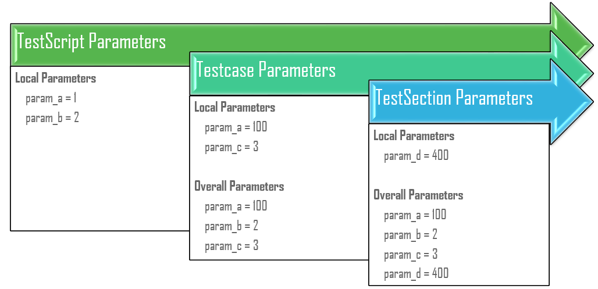

.. _test_parameters:

Test Parameters
===============

.. sidebar:: Helpful Reading

    - `Function Arguments`_
    - `Data-Driven Programming`_
    - `Mutable/Immuntable Objects`_
    - `Variable Scoping`_

.. _Data-Driven Programming: http://en.wikipedia.org/wiki/Data-driven_programming
.. _Function Arguments: https://docs.python.org/3.4/tutorial/controlflow.html#more-on-defining-functions
.. _Mutable/Immuntable Objects: http://en.wikibooks.org/wiki/Python_Programming/Data_Types#Mutable_vs_Immutable_Objects
.. _Variable Scoping: https://docs.python.org/3.4/reference/executionmodel.html

``aetest`` is a data-driven test infrastructure. Its scripts and testcases are
intended to be driven dynamically by:
    
- data in the form of input arguments to the testscript
- dynamic data generated during runtime

The collection of dynamic data that artificially affects the behavior of
testscripts and testcases in ``aetest`` is called **parameters**. It adheres to
a pre-defined set of parent/child propagation relationships, and may be used as
`Function Arguments`_ to each test section. 

This feature is a supplement to static testcase data (attribute values stored
within each testcases).

.. tip::

    The concept of parameters in ``aetest`` and its underlying object 
    relationship model is rather complex. This section of the documentation
    is structured so that the understanding of this core concept is built-up
    iteratively - *peeling the onion*.

The Whys
--------

Before delving deeper into the concept and mechanism of **parameters**, let's
first spend some time on what it is, why they are needed, and how they may
benefit the end user.

Parameters are a special kind of variable, used within functions and methods to 
refer and access its input data (arguments). If you consider the function and
methods as the "doer", then parameters are the "what to do with". Eg, an 
``add`` function would require 2 or more parameters to be "added together".

.. code-block:: python

    # Example
    # -------
    #
    #   parameters & arguments

    # static base value
    c = 100

    # within the scope of this function definition
    # "a" and "b" are considered its function parameters
    # and accessible within the function as variables a and b
    # "c" is a static data value.
    def add_to_c(a, b):
        print("a=", a)
        print("b=", b)
        return a+b+c

    # when calling this function
    # 1 and 2 are called arguments to this function
    # which is mapped to function parameters positionally as
    # a=1, b=2 within the actual function
    add_to_c(1, 2)
    # 103

In a data-driven testing, testscripts are the *doers*, performing the act
of testing a facet of some product. Its arguments and parameters are thus the 
input data that influences the specific acts of testing being carried out. Here 
are some possible use cases:

    - ``testbed`` argument to a script tells it which testbed to run on, and
      what the topology is like. The script can then connect to the testbed, and
      decide how to perform the testing best suited for this topology.

    - ``vlan`` argument to ``layer2_traffic`` script can dynamically control the
      vlan to be be configured for traffic testing.

    - other toggle arguments that dynamically turns on/off certain testcases,
      and/or combination of features to be configured & tested
    
    - etc.

Of course, the parameters feature in ``aetest`` is much more than just script
arguments. It enables users to write testcases and testscripts that are capable
of being driven by inputs, varying the degree of testing, etc.

Relationship Model
------------------

In ``aetest``, parameters are **relative**: parameters corresponding to each
object is the combination of its local specific parameters, and all of its 
parent object's parameters. Eg:

- ``Testcase`` parameters = local parameters + ``TestScript``
  parameters

- ``TestSection`` parameters = local parameters + ``Testcase``
  parameters + ``TestScript`` parameters.

This relationship follows the :ref:`parent` model described in the previous
runtime behaviors section: each object has a parent, and the parameters seen
at each object level is an aggregation of its and all of its parent's
parameters.

In case when an object and its parent (or its parent's parent, etc) have the same
parameter names defined, then the parameter value closest to the current scope
is used/prefered. 

    *Parameter Relationship Model In a Nutshell*

Below is a behavior demonstration of this relationship model. In actual script
execution, this happens behind-the-scenes automatically. 

.. code-block:: python

    # Example
    # -------
    #
    #   pseudo-code, intending to demonstrate the behavior relationship
    #   of object parameters & their parents.

    # in this example, assume there are the following objects:
    #   
    #   testscript: the TestScript object
    #   testcase:   the Testcase object. (parent=testscript)

    # testscript has parameters
    testscript.parameters = {
        'param_A': 1,
        'param_B': 2,
    }

    # testcase has the following local parameters
    # note that "param_A" is already defined at its parent level
    # but "param_C" is new
    testcase.parameters = {
        'param_A': 100,
        'param_C': 3,
    }

    # during runtime, the combined parameters seen at the 
    # testcase level, would be equivalent to the following:
    #   - take the testscript parameters as basis
    #   - and add to it, testcase parameters
    # 
    # eg:
    new_testcase_parameters = testscript.parameters.copy()
    new_testcase_parameters.update(testcase.parameters)
    testcase.parameters = new_testcase_parameters

    # so that the new parameters seen at the testcase
    # level, is:
    testcase.parameters
    # {'param_A': 100, 'param_B': 2, 'param_C': 3}

.. hint::
    
    in other words, childs inherits but shadows parent parameters. This is 
    similar to Python `Variable Scoping`_ concept.

Parameters Property
-------------------

Every top-level object in ``aetest`` comes with the special ``parameters`` 
property: a dictionary containing the key/value data pairs relative to this
object (:ref:`object_model`). Its default values can be set/updated by the user
within the testscript.

.. code-block:: python

    # Example
    # -------
    #
    #   an aetest testscript with lots of parameters pre-defined
    #   (pre-definition: defining parameters within the script directly)

    from pyats import aetest

    # testscript level default parameters can be defined by
    # setting a dictionary within your testscript named "parameters"
    # (this is a reserved keyword)
    parameters = {
        'testscript_param_A': 'some value',
        'testscript_param_B': [],
        'generic_param_A': 100
    }

    # using Testcase to demonstrate TestContainer-type parameters definitions
    # note that this also is applicable to CommonSetup & CommonCleanup
    class Testcase(aetest.Testcase):

        # all default parameters specific to this testcase is declared
        # in its own parameters dictionary. 
        parameters = {
            'generic_param_A': 200
        }

        # etc ...

During runtime, these dictionaries form the baseline ``parameters`` properties
of their corresponding section. Eg:

    - script-level ``parameters`` dictionary is used to create ``TestScript``
      object parameters.
    - Testcase-level ``parameters`` dictionary is used to create that
      ``Testcase`` object parameter.

One exception to the above is method local parameters for sections such as
``subsection``, ``setup``, ``test`` and ``cleanup``. Even though their 
corresponding classes (``Subection``, ``SetupSection``, ``TestSection``,
``CleanupSection``) also have the parameters property, these class instances
only exists briefly during runtime (see :ref:`aetest_function_classes`), so
their attributes are mostly only dynamic in nature, set & controlled by the
infrastructure. This is also coupled with the fact that adding attributes (such
as ``parameters``) to methods definitions are rather awkward to code in the 
script. Thus, for all intents and purposes, consolidate section specific 
parameters to their parent ``TestContainer`` sections.

In addition to pre-defined parameters within the script, it is also possible to
dynamically access & update parameters. 

.. important::
    
    even though parameters seen at each object level also includes its parent's 
    parameters, setting & updating the parameters dictionary is only reflected
    locally, and does not propagate to the parent. This is also inline with how
    Python  `Variable Scoping`_ works.

.. code-block:: python

    # Example
    # -------
    #
    #   continuing from the above

    # re-defining the testcase for the sake of code-continuity
    class Testcase(aetest.Testcase):

        # local parameters defaults, same as above
        parameters = {
            'generic_param_A': 200
        }

        # within any sections, the parent container parameters are directly
        # accessible (applicable to setup/test/cleanup and subsections)
        
        # here we'll do a combination access & updating of parameters
        @aetest.setup
        def setup(self):
            # add to the parameters dict
            self.parameters['new_parameter_from_setup'] = 'new value'

            # overwrite a testscript parameter
            # note that this creates a local parameter with the same
            # name, and shadows the one from the parent testscript.
            # the actual parent testscript parameter is unchanged.
            self.parameters['testscript_param_A'] = 'another value'

        @aetest.test
        def test(self):
            # access & print parent testscript parameters
            # (following the parent model)
            print(self.parent.parameters)
            # {'generic_param_A': 100, 
            #  'testscript_param_B': [], 
            #  'testscript_param_A': 'some value'}

            # access & print all current known parameter
            # this also includes any parameters from the parent
            # (shadowed by local parameters, if the same name exists)
            print(self.parameters)
            # {'new_parameter_from_setup': 'new value',
            #  'generic_param_A': 200, 
            #  'testscript_param_B': [], 
            #  'testscript_param_A': 'another value'}

Consider the above example: parameters can be set and acccessed as the script
runs, opening up the opportunity for scripts to dynamically discover the runtime
environment and modify test behavior (parameters) as required. Eg, ``setup``
section of modifying testcase parameters based on current testbed state, and
altering the behavior of ensuiting ``test`` sections, etc.

.. tip::
    
    ``parameters`` properties are implemented internally as a ``ChainMap``
    object. See `Collections.ChainMap`_ documentation if you are eager to know.

.. _Collections.ChainMap: https://docs.python.org/3/library/collections.html#collections.ChainMap

.. _script_args:

Script Arguments
----------------

In short, any arguments passed to the testscript before startup becomes part of
the ``TestScript`` parameter. This includes all the arguments passed through the
:ref:`easypy_jobfile` during :ref:`aetest_jobfile_execution`, and/or any command
line arguments parsed and passed to ``aetest.main()`` during 
:ref:`aetest_standalone_execution`. 

.. code-block:: python

    # Example
    # -------
    #
    #   script parameters and how it works
    #   (pseudo code, for demonstration only)

    # without going into details of how script parameters/arguments are
    # passed in (covered under Running Scripts section)

    # assuming that the testscript was called with the following inputs
    script_arguments = {
        'arg_a': 100,
        'arg_c': 3,
    }

    # and that the script file has the following parameters defined
    parameters = {
        'arg_a': 1,
        'arg_b': 2,
    }

    # the TestScript parameter would be built as follows
    testscript.parameters = parameters
    testscript.parameters.update(script_arguments)

    # the resulting values
    testscript.parameters
    # {'arg_a': 100,
    #  'arg_b': 2,
    #  'arg_c': 3}

As demonstrated in the above example, script arguments/parameters are actually
added on top of ``TestScript`` parameters defined within the script. In
other words, script arguments are added dynamically to the current running 
script's base parameters, and overwrites any existing ones.

.. tip::
    
    define your default parameters in the script, and change the behavior of
    the testscript by overwriting specific ones using script arguments.

.. _parameters_as_funcargs: 

Parameters as Function Arguments
--------------------------------

``parameters`` property & functionality provides a means for objects within 
``aetest`` to follow the :ref:`parent` model and aggregate data together in a
clean, accessible format. It serves also as the basis for providing section
methods their `Function Arguments`_. This is the main mechanism behind the 
data-driven concept of ``aetest``: function/methods are **driven** by input
parameters.

During runtime, all section method function arguments are filled by their
corresponding parameter value, matching the argument name vs. the parameter
key/name. The following table describes the types of function arguments and
their supports.

.. csv-table:: Function Argument Types & Parameters Support
    :header: "Type", "Example", "Comments"

    "keyword args", ``my_param``, "matched up with the corresponding parameter"
    "argument defaults", ``my_param=10``, "default value used when the
    parameter is undefined"
    "arbitrary args", ``*args``, "not supported"
    "arbitrary keywords", ``**kwargs``, "all known parameters are passed in"
    "keywords-only args", "``*, my_param``", "same as keyword args
    (python-3 only)"

.. code-block:: python

    # Example
    # -------
    #
    #   parameters as function arguments

    from pyats import aetest

    # define some default script-level parameters
    #   param_A: a static value of 1
    #   param_B: an empty dictionary
    parameters = {
        'param_A': 1,
        'param_B': dict(),
    }

    class Testcase(aetest.Testcase):

        # this setup section definition identifies "param_B" as 
        # as a input requirement. as this parameter is available at this
        # testcase level (aggregated from parent testscript), it 
        # is passed in as input
        @aetest.setup
        def setup(self, param_B):

            # param_B is a dictionary (mutable)
            # any modification to this dictionary persists
            param_B['new_key'] = "a key added during setup section"

        # section needing both "param_A" and "param_B"
        @aetest.test
        def test_one(self, param_A, param_B):
            print(param_A)
            # 1
            print(param_B)
            # {'new_key': 'a key added during setup section'}

        # calling for a non-existent parameter
        # hence the default value is taken
        # (if no defaults are provided, an exception is raised)
        @aetest.test
        def test_two(self, param_non_existent = 1000):
            print(param_non_existent)
            # 1000

        # using arbitrary keywords **kwargs
        # all known parameters are passed in as a dictionary
        @aetest.cleanup
        def cleanup(self, **kwargs):
            print(kwargs)
            # {'param_A': 1, 
            #  'param_B': {'new_key': 'a key added during setup section'}}

This is the preferred method of accessing parameters: by passing each in
explicitly as function arguments. It is more pythonic:

    - explictly passing in parameters makes the code (and its dependencies)
      easier to read and understand

    - allows the infrastructure to handle error scenarios (such as missing
      parameters)

    - allows users to easily define defaults (without dealing with dictionary
      operations)

    - maintaining the ability to call each section as a function with various
      arguments during test/debugging situations. 

    - etc...

.. tip::
    
    once a parameter is passed into a section as a function argument, it becomes
    a local variable. All rules of `Variable Scoping`_ apply.

Callable Parameters
-------------------

A callable parameter is a one that evaluates to ``True`` using callable_. When 
a callable parameter is filled as a function argument to test sections, the 
infrastructure "calls" it, and uses its return value as the actual argument 
parameter. 

.. code-block:: python

    # Example
    # -------
    #
    #   callable parameter example

    import random
    from pyats import aetest

    # define a callable parameter called "number"
    # the provided parameter value is the random function, imported
    # from python random library. 
    # when called, random.random() generates a float number between 0 and 1
    parameters = {
        'number': random.random,
    }

    class Testcase(aetest.Testcase):

        # as the "number" parameter's value is the callable function
        # random.random, this function is evaluated right before the 
        # execution of this test method, and the call result is then used
        # as the actual argument input
        @aetest.test
        def test(self, number):

            # test whether the generated number is greater than 0.5
            assert number > 0.5
            # if you run this test enough times
            # you will find that it passes exactly 50% of the time
            # assuming that random.random() generate truly random numbers :)

            # note that callable parameters are only evaluated if used
            # as function arguments. they are still objects if viewed
            # through the parameters property
            self.parameters['number']
            # <built-in method random of Random object at 0x91e2fc4>

Callable parameters still shows up as their original function object when 
accessed through ``parameters`` property. They are only evaluated (called) when
used as function arguments to test methods. This evaluation occurs "on demand":

    - the evalution takes place right before method execution.

    - each method gets its own indepedent evaluated result.

The only limitation with callable parameters is that they cannot have arguments.
``aetest`` would not know how to fulfill them during runtime. 

.. tip::

    eliminate function arguments (by pre-setting them) with
    `partial functions`_.

.. _callable: https://docs.python.org/3.4/library/functions.html#callable
.. _partial functions: https://docs.python.org/3.4/library/functools.html#functools.partial

Parametrizing Functions
-----------------------

Parametrized functions are a special breed of "smart" callable parameters. They
support arguments, are capable of identifying the current execution context, and 
act accordingly.

A parametrized function is declared when the ``@parameters.parametrize`` 
decorator is used on a function in your testscript. This also adds the newly
created parametrized function automatically as part of ``TestScript`` 
parameters, using the function name as the parameter name. 

During runtime, the behavior of these parametrized functions is exactly 
identical to its callable parameter sibling, with the following additions:
    
    - any arguments to the ``@parameters.parametrize`` decorator are stored
      and used as function arguments during the evaluation.

    - if an argument named ``section`` is defined for a parametrized function,
      the current section object is passed to the function.

.. code-block:: python

    # Example
    # -------
    #
    #   parametrized function example

    import random
    from pyats import aetest

    # defining a parametrized function called "number"
    # ------------------------------------------------
    # this function accepts a lower and an upper bound, and 
    # uses the random.randint() api to do the actual work.
    # as part of this parametrization declaration, notice that
    # a lower_bound and an upper_bound was provided. these values
    # are used as function arguments when the function is evaluated 
    @aetest.parameters.parametrize(lower_bound=1, upper_bound=100)
    def number(lower_bound, upper_bound):
        return random.randint(lower_bound, upper_bound)

    # defining a parametrized function named "expectation"
    # ----------------------------------------------------
    # this is a smart function: it can decide what to return
    # based on the current section object information.
    # it accepts the current section as input, and
    # returns 999 when the section uid is 'expected_to_pass', or 0 otherwise.
    @aetest.parameters.parametrize
    def expectation(section):
        if section.uid == 'expected_to_pass':
            return 9999
        else
            return 0

    # as previously stated, there's no need to add parametrized functions
    # to the parameters dict(). They are automatically discovered and added.

    # defining two tests under this testcase
    # ----------------------------------------------
    # similar to callable parameters, the above parameters
    # are evaluated when used as function arguments to section
    # the only difference is the support for parameter function arguments.
    class Testcase(aetest.Testcase):

        # this section is expected to pass
        # the generated number is between 1 and 100, and the
        # expectation is 9999 (as section uid is "expected_to_pass")
        @aetest.test
        def expected_to_pass(self, number, expectation):
            # test whether expectation is > than generated number
            assert expectation > number

        # this section is expected to fail
        # the generated number is still between 1 and 100, but the
        # expectation is 0 (as section uid is not "expected_to_pass")
        @aetest.test
        def expected_to_fail(self, number, expectation):
            # test whether expectation is > than generated number
            assert expectation > number

Essentially, parametrized functions allows users to create smart, dynamic 
parameter values that can vary based on the current state of execution: by 
leveraging the :ref:`object_model` and :ref:`parent` relationship, the use cases
are endless:

    - return values based on current or parent section uid/type/result

    - return values based on a combination of parameters available to the curent
      section

    - etc.

.. warning::
    
    when using ``section`` argument in parametrized function, the provided 
    section object is the same as the internal parameter described in the next
    topic below. Try not to break stuff.

.. _reserved_parameters:

Reserved Parameters
-------------------

Reserved parameters are those that are generated by the test infrastructure
during runtime. They are not normally seen when accessing the ``parameters``
dictionary property, but are extremely useful when you need to refer to
``aetest`` internal objects that are normally unaccessible, and are needed when
using certain ``aetest`` optional features, such as :ref:`aetest_steps`. 

.. csv-table:: Current Reserved Parameters
    :header: Name, Type, Description
    :widths: 15, 15, 70

    ``testscript``, internal,  proxy to the ``TestScript`` object
    ``section``, internal, "proxy to the current test section object. 
    Eg: ``TestSection``"
    ``steps``, feature, "proxy to ``Steps`` object for :ref:`aetest_steps` 
    feature."

.. code-block:: text
    
    Reserved Parameter Types
    ------------------------

    internal: parameter offering access to AEtest internal objects
    feature: optional feature, enabled only when parameter is used as funcargs

Reserved parameters are special: they are only accessible if their name is
provided as a keyword argument to test methods (or in the case of parametrized 
functions, ``section`` as a function input argument). They remain hidden in all 
other cases. 

They are *reserved*: eg, they are resolved first and takes precedence over 
normal parameters. In the case where a normal parameter is created with the
same name, that parameter is only accessible using the ``parameters`` 
property, and is not useable as a function argument.

.. code-block:: python

    # Example
    # -------
    #
    #   accessing reserved parameters

    from pyats import aetest

    # using CommonSetup as an example
    # also applicable to other TestContainer classes
    class CommonSetup(aetest.CommonSetup):

        # create a local parameter with the same name
        # as the reserved parameter
        parameters = {
            'steps': object(),
        }

        # access reserved parameters by providing their
        # names as keyword arguments to methods
        @aetest.subsection
        def subsection_one(self, testscript, section, steps):
            # testscript object has an attribute called module
            # which is this testscript's module
            print (testscript.module)
            # <module 'example_script' from '/path/to/example.py'>

            # current section object is Subsection
            # and subsections have a unique uid
            print(section.uid)
            # subsection_one

            # steps object enables the usages of steps
            with steps.start('a new demo step'): 
                pass

        # reserved parameters do not show up in **kwargs 
        @aetest.subsection
        def subsection_two(self, **kwargs):

            # only the locally defined steps parameter show up
            print(kwargs)
            # {'steps': <object object at 0xf76fec80>}

        # reserved paramters takes precedence when resolved.
        @aetest.subsection
        def subsection_three(self, steps):

            # test steps is not the same as local paramter
            steps is not self.parameters['steps']
            # True

Reserved parameters provides ``aetest`` a mechanism to offer optional features
without polluting the :ref:`object_model` with additional attributes. It also
allows users to write testscripts that delve deeper and interact with the 
internals of ``aetest`` using a supported method, instead of hacking around.

    *With great power, comes great responsibilities* - use them wisely.

.. tip::

    there is no reserved parameter for the current ``TestContainer``, as the
    class instance is naturally provided to bound methods as the first
    argument (eg, ``self``).

.. warning::

    modifying internal parameters without knowing what you're doing may result
    in catastrophic failures, and/or inexplicable script behaviors. 

    Monkey patching internals is strictly prohibited. Doing so will void your
    warranty: **no further support will be provided.**
