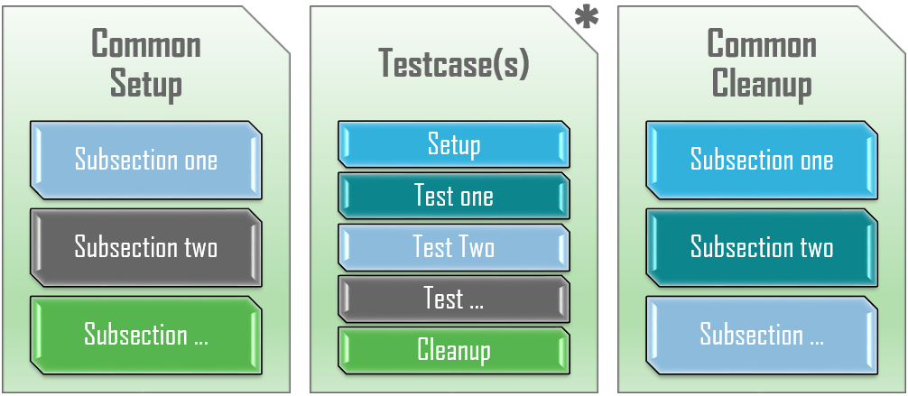

.. _aetest_script_structure:

Script Structure
================

AEtest testscript structure is very modular and straightforward. Each testscript
is split into three major container sections which are then further broken down
into smaller, method sections. 

.. sidebar:: Helpful Reading

    - `Classes Tutorial`_

    - `Decorators`_

.. contents:: Jump To Section...
    :local:

.. _Decorators: https://wiki.python.org/moin/PythonDecorators
.. _Classes Tutorial: https://docs.python.org/3.4/tutorial/classes.html

--------------------------------------------------------------------------------

.. _common_setup:

Common Setup
------------

``CommonSetup`` is where all the common configurations, prerequisites and
initializations shared between the script's testcases should be performed. This
includes but is not limited to the following:
    
    - check the validity of script inputs (arguments)

    - connect to all testbed devices & check that they are ready, with all the
      required images/features/hardwares/licenses (including Traffic Generators)

    - configure/bring up the device interface and/or topology

    - setup/load base configuration common/shared between all testcases

    - setup dynamic looping of testcases/sections based on current environment

    - etc

+-------------------+----------------------------------------------------------+
| Trait             | Description                                              |
+===================+==========================================================+
| name/uid          | always reported as ``common_setup``                      |
+-------------------+----------------------------------------------------------+
| mandatoriness     | optional within each testscript                          |
+-------------------+----------------------------------------------------------+
| sub-divisions     | if defined, must be sub-divided into ``subsections``     |
+-------------------+----------------------------------------------------------+
| dependency        | none: always run (unless explicitly skipped)             |
+-------------------+----------------------------------------------------------+
| result            | combined roll up of all contained ``subsections``        |
+-------------------+----------------------------------------------------------+
| result item count | counts as 1                                              |
+-------------------+----------------------------------------------------------+

``CommonSetup`` is an optional container section within each testscript. It is
defined by inheriting the ``aetest.CommonSetup`` class, and declaring one or
more :ref:`subsection` inside. ``CommonSetup`` is always run first, before all
testcases. 

``CommonSetup`` section is unique within each testscript: only one may be
defined, and regardless of the class name used, its reporting/result uid is
always ``common_setup``. 

``CommonSetup`` result is a combined roll-up result of all of its subsections, 
and its result counts as ``1`` in the summary table of result numbers.

.. code-block:: python

    # Example
    # -------
    #
    #   an example common setup

    # import the aetest module
    from pyats import aetest

    # define a common setup section by inherting from aetest
    class ScriptCommonSetup(aetest.CommonSetup):

        @aetest.subsection
        def check_script_arguments(self):
            pass

        @aetest.subsection
        def connect_to_devices(self):
            pass

        @aetest.subsection
        def configure_interfaces(self):
            pass

.. _testcases:

Testcases
---------

``Testcase`` is a container/collection of smaller tests. Testcases are the 
workhorse of every testscript, carrying out the assessments that determines 
the quality of the product under scrutiny. Each testcase may have its own
:ref:`setup_section` and :ref:`cleanup_section`, and an arbitrary number of 
smaller :ref:`test_section`.

+-------------------+----------------------------------------------------------+
| Trait             | Description                                              |
+===================+==========================================================+
| uid               | testcase's unique id, default to its class name          |
+-------------------+----------------------------------------------------------+
| mandatoriness     | what's a testscript without testcases?                   |
+-------------------+----------------------------------------------------------+
| sub-divisions     | ``setup``, ``test``, ``cleanup``                         |
+-------------------+----------------------------------------------------------+
| dependency        | ``CommonSetup`` must pass                                |
+-------------------+----------------------------------------------------------+
| result            | combined roll up of all contained sections               |
+-------------------+----------------------------------------------------------+
| result item count | 1 for each testcase                                      |
+-------------------+----------------------------------------------------------+

Each ``Testcase`` is defined by inheriting ``aetest.Testcase`` class, and
defining one or more :ref:`test_section` inside. Optionally, each ``Testcase`` 
may also have a single :ref:`setup_section` and a single :ref:`cleanup_section`.
Testcases are run in the order as they are defined/appear in the testscript.

Testcases are unique: each ``Testcase`` is associated with a unique ID. This
defaults to the testcase's class name, and can be changed by setting the 
``Testcase.uid`` attribute. This testcase unique ID is used for result reporting
purposes.

``Testcase`` are independent: the testing code of a ``Testcase`` instance should
be entirely self-contained, such that it can be run either in isolation or in
arbitrary combination with any number of testcases. Each testcase shall test 
out a unique aspect of the product, is self-reliant, and its result separate 
from all other testcases. 

Each testcase's result is a combined roll-up result of all of its child 
sections, and its result counted for as ``1`` in the summary table of result 
numbers.

.. code-block:: python

    # Example
    # -------
    #
    #   two example testcase

    # import the aetest module
    from pyats import aetest

    # define a simple testcase by inheriting aetest.Testcase
    # this testcase's uid is defaulted to "SimpleTestcase"
    class SimpleTestcase(aetest.Testcase):

        @aetest.test
        def trivial_test(self):
            assert 1 + 1 == 2

    # testcases could also have its own setup/cleanups
    class SlightlyMoreComplexTestcase(aetest.Testcase):

        # providing this testcase a user-defined uid
        uid = 'id_of_this_testcase'

        @aetest.setup
        def setup(self):
            self.value = 1

        @aetest.test
        def another_trivial_test(self):
            self.value += -1
            assert self.value == 0

        @aetest.cleanup
        def cleanup(self):
            del self.value

.. _common_cleanup:

Common Cleanup
--------------

``CommonCleanup`` is the last section to run within each testscript. Any 
configurations, initializations and environment changes that occured during this
script run should be cleaned up (removed) here. Eg, the testbed/environment 
should be returned to the same state as it was before the script run. This
includes but is not limited to:

    - removal of all ``CommonSetup`` changes in their appropriate, reversed
      order

    - removal of any lingering changes that were left from previous testcases

    - returning all devices & etc to their initial state

    - etc

Note that ``CommonCleanup`` should be catch-all: regardless of whether previous
sections passed or failed, or whether they cleaned up after themselves, this
section should catch-it-all, and return the testbed/environment to its original
state.

+-------------------+----------------------------------------------------------+
| Trait             | Description                                              |
+===================+==========================================================+
| name/uid          | always reported as ``common_cleanup``                    |
+-------------------+----------------------------------------------------------+
| mandatoriness     | optional within each testscript                          |
+-------------------+----------------------------------------------------------+
| sub-divisions     | if defined, must be sub-divided into ``subsections``     |
+-------------------+----------------------------------------------------------+
| dependency        | none: always run (unless explicitly skipped)             |
+-------------------+----------------------------------------------------------+
| result            | combined roll up of all contained ``subsections``        |
+-------------------+----------------------------------------------------------+
| result item count | counts as 1                                              |
+-------------------+----------------------------------------------------------+

``CommonCleanup`` is an optional container section within each testscript. It is
defined by inheriting the ``aetest.CommonCleanup`` class, and declaring one or
more :ref:`subsection` inside. ``CommonCleanup`` is always run last, after all
testcases. 

``CommonCleanup`` section is unique within each testscript: only one may be
defined, and regardless of the class name used, its reporting/result uid 
is always ``common_cleanup``. 

``CommonCleanup`` result is a combined roll-up result of all of its subsections, 
and its result counts as ``1`` in the summary table of result numbers.

.. code-block:: python

    # Example
    # -------
    #
    #   an example common cleanup

    # import the aetest module
    from pyats import aetest

    # define a common cleanup section by inherting from aetest
    class ScriptCommonCleanup(aetest.CommonCleanup):

        @aetest.subsection
        def remove_testbed_configurations(self):
            pass

        @aetest.subsection
        def disconnect_from_devices(self):
            pass

--------------------------------------------------------------------------------

.. _subsection:

Subsections
-----------

Subsections are the bricks-and-mortars that make up ``CommonSetup`` and 
``CommonCleanup``. Within these class definitions, any methods decorated
with ``@subsection`` decorator is marked to be a subsection. Consider each 
subsection as an identifiable action to be completed as part of the greater 
section.

+-------------------+----------------------------------------------------------+
| Trait             | Description                                              |
+===================+==========================================================+
| name/uid          | same as the method name                                  |
+-------------------+----------------------------------------------------------+
| result            | each ``subsection`` has its own result                   |
+-------------------+----------------------------------------------------------+
| dependency        | none                                                     |
+-------------------+----------------------------------------------------------+
| result item count | 0 - subsections results are rolled into parent result    |
+-------------------+----------------------------------------------------------+

When a ``CommonSetup`` or ``CommonCleanup`` class method is decorated with
``@subsection``, the corresponding method name is used as the subsection name 
for result reporting. 

Subsections are indepedent: each subsection runs regardless of any previous
section's result. The control of whether to abort/skip/continue after an 
unexpected result is entirely in the hands of the user.

Subsection results are not accounted for in the summary number of test results.
Its result is rolled-up into the parent common section.

.. code-block:: python

    # Example
    # -------
    #
    #   subsections

    from pyats import aetest

    # subsections exists within CommonSetup
    class ScriptCommonSetup(aetest.CommonSetup):

        # define subsections by applying @subsection decorator
        @aetest.subsection
        def common_setup_subsections(self):
            pass

    # -------------------------------------------

    # subsections exists within CommonCleanup
    class ScriptCommonCleanup(aetest.CommonCleanup):

        # define subsections by applying @subsection decorator
        @aetest.subsection
        def common_cleanup_subsections(self):
            pass

.. _setup_section:

Setup Section
-------------

``setup`` is an sub-division section, available for ``Testcase``. It can be used
to perform all the common configuration, prerequisites and initializations 
specific to that testcase. Here are some examples:

    - configure/enable the features tested by this testcase

    - configure the interfaces/routes used by this testcase

    - configure the traffic generator with the traffic patterns/streams to be
      used by this testcase

    - etc

+-------------------+----------------------------------------------------------+
| Trait             | Description                                              |
+===================+==========================================================+
| name/uid          | always reported as ``setup``                             |
+-------------------+----------------------------------------------------------+
| mandatoriness     | optional within each testcase                            |
+-------------------+----------------------------------------------------------+
| dependency        | none: always run for this testcase                       |
+-------------------+----------------------------------------------------------+
| result            | ``setup`` section has its own result                     |
+-------------------+----------------------------------------------------------+
| result item count | 0 - setup section result is rolled into parent result    |
+-------------------+----------------------------------------------------------+

``setup`` section is defined by decorating a ``Testcase`` class method with 
``@aetest.setup`` decorator. It is optional to each testcase: if defined, it 
always runs before all other sections.

``setup`` is unique: each ``Testcase`` may only have one method decorated to 
be its setup section. Regardless of this method's function name, its 
reporting/result uid is always named ``setup``.

``setup`` section's result does not count in the summary number of result items:
it is rolled up into the parent ``Testcase`` result. However, if the 
``setup`` section fails, all ensuing test sections would become blocked. 

.. code-block:: python

    # Example
    # -------
    #
    #   setup sections

    from pyats import aetest

    # setup section within Testcases
    class Testcase(aetest.Testcase):

        # define setup section by applying @setup decorator
        @aetest.setup
        def testcase_setup(self):
            pass

.. _test_section:

Test Sections
-------------

``test`` sections are the smallest units of testing and the most basic building
block that makes up ``Testcase``. Each ``test`` should carry out a single 
identifiable check/evaluation to be completed as part of the greater section.

+-------------------+----------------------------------------------------------+
| Trait             | Description                                              |
+===================+==========================================================+
| name/uid          | same as the method name                                  |
+-------------------+----------------------------------------------------------+
| result            | each ``test`` has its own result                         |
+-------------------+----------------------------------------------------------+
| dependency        | ``setup`` section must pass                              |
+-------------------+----------------------------------------------------------+
| result item count | 0 - test section results are rolled into parent result   |
+-------------------+----------------------------------------------------------+

``test`` section is defined by decorating a ``Testcase`` class method with 
``@aetest.test`` decorator. The corresponding method name is used as the test 
name for result reporting. Each testcase must have at least one or more ``test``
section.

``test`` sections normally run in the order of definition, and always run
regardless of previous test section results. Each ``test`` has its own result, 
but it is not counted towards the summary number of result items: its result is
rolled up to the parent ``Testcase`` result. 

.. code-block:: python

    # Example
    # -------
    #
    #   test sections

    from pyats import aetest

    # test section within Testcases
    class Testcase(aetest.Testcase):

        # define test section by applying @test decorator
        @aetest.test
        def a_testcase_test(self):
            pass

.. _cleanup_section:

Cleanup Section
---------------

``cleanup`` is the last sub-division section within each ``Testcase``. Any 
configurations, initializations & changes that occured during this testcase
should be cleaned up (removed) here. Eg, the testbed/environment should be 
returned to the same state as it was before the current testcase. Here are 
some things to look for:

    - any configurations/changes made by this testcase's ``setup``
      section

    - any lingering changes from all sections within this testcase

    - returning devices & etc to their state before the testcase run

    - etc

Note that ``cleanup`` section should be catch-all: regardless of whether all
``tests`` before it passed or failed, it should be still able to return the 
environment to its original state.

+-------------------+----------------------------------------------------------+
| Trait             | Description                                              |
+===================+==========================================================+
| name/uid          | always reported as ``cleanup``                           |
+-------------------+----------------------------------------------------------+
| mandatoriness     | optional within each testcase                            |
+-------------------+----------------------------------------------------------+
| dependency        | none: always run for this testcase                       |
+-------------------+----------------------------------------------------------+
| result            | ``cleanup`` section has its own result                   |
+-------------------+----------------------------------------------------------+
| result item count | 0 - cleanup section result is rolled into parent result  |
+-------------------+----------------------------------------------------------+

``cleanup`` section is defined by decorating a ``Testcase`` class method with 
``@aetest.cleanup`` decorator. It is optional to each testcase: if defined, it
always runs after all other sections.

``cleanup`` is unique: each ``Testcase`` may only have one method decorated to 
be its cleanup section. Regardless of this method's function name, its 
reporting/result uid is always named ``cleanup``.

``cleanup`` section's result does not count in the summary number of result 
items: it is rolled up into the parent ``Testcase`` result. 

.. code-block:: python

    # Example
    # -------
    #
    #   cleanup sections

    from pyats import aetest

    # cleanup section within Testcases
    class Testcase(aetest.Testcase):

        # define cleanup section by applying @cleanup decorator
        @aetest.cleanup
        def testcase_cleanup(self):
            pass
