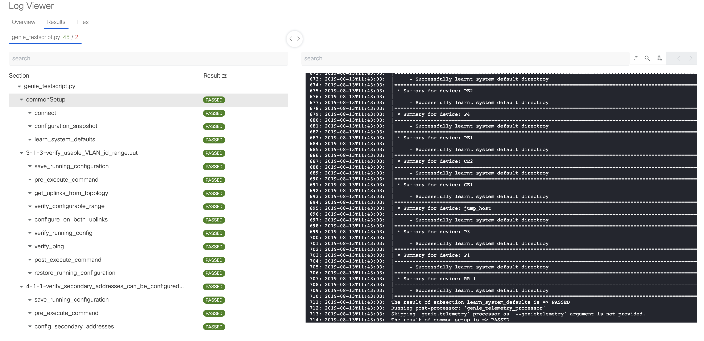

.. _pyats_logs_cli:
pyats logs
==========

Execution command for viewing logs of previous or current runs with pyATS.

.. code-block:: text

    Usage:
      pyats logs <subcommand> [options]

    Subcommands:
        list                list all log archives
        view                open and view log archives in browser

    General Options:
      -h, --help            Show help
      -v, --verbose         Give more output, additive up to 3 times.
      -q, --quiet           Give less output, additive up to 3 times, corresponding to WARNING, ERROR,
                            and CRITICAL logging levels

pyats logs view
---------------

This subcommand will host a local webpage with a graphical view of the
pass/fail summary,results table, logs, and excuted commands of a job run.
It not only supports previous finished runs, but also gives a live dashboard
for current runs.

.. code-block:: text

    Usage:
      pyats logs view [archive] [options]

    Description:
      Opens pyATS generated archive zip files and host them through HTTP server.

      Behavior:
          - List all archives stored in standard known archive locations in reverse
            order on webpage.
          - Click to view detail results of an archive.
          - set environment variable $BROWSER to your browser executable to force using
            your provided browser
          - if liveview is enabled, opens the lastest running job.

      Examples:
          # opens the archive list page
          $ pyats logs view

          # open the last archive file
          $ pyats logs view --latest

          # open a specific archive file
          $ pyats logs view /path/to/archive.zip

    View Options:
      [archive/runinfo_dir] Archive zip file or runinfo directory to open and view.
      --latest              If provided, open last archive file, else, open result list page.
      --host [host]         Host interface to bind to. Default to: localhost
      --port [port]         Interface port to bind to. Default to: 0
      --hostname [hostname] Displayed hostname for logviewer/liveview.
      --reuse-port          Flag when set, reuses a TCP port in TIME_WAIT state
      --no-browser          Flag to turn off the default behavior of opening a new browser window.
      --liveview            Flag to enable liveview. Default to: False

    General Options:
      -h, --help            Show help
      -v, --verbose         Give more output, additive up to 3 times.
      -q, --quiet           Give less output, additive up to 3 times, corresponding to WARNING, ERROR,
                            and CRITICAL logging levels

By default ``pyats logs view`` will display a list of result archives it
can find in following 3 places:

1. <python_env>/users/<username>/<runinfo|archive>

2. ~/.pyats/<runinfo|archive>

3. archive and runinfo location set in pyats.conf, for example:

.. code-block:: text

    [easypy]
    runinfo.archive = /home/myuser/pyATS/archive
    runinfo.directory = /home/myuser/pyATS/runinfo

A specific archive can be chosen by also passing the location of that
archive.

If --liveview is appended, ``pyats logs view --liveview`` will open results from
the latest runinfo directory it can find. A runinfo directory can also be passed
to specify the run to view.

The logs will be served from ``localhost`` on a random port. If you want to make
it accessible by everyone (eg, remote users over network), pass in
``--host 0.0.0.0`` to serve on all interfaces.

When started, the logs webpage will be opened automatically in your
default system browser. You can customize the browser to use by setting
environment variable ``BROWSER`` to the path of your favorite browser
executable, or by setting the corresponding pyATS configuration.

The following is an example of what the webpage looks like:

Each tab shows the detailed results of each section of each testscript, as well
as all commands executed and specific sections of logs.
