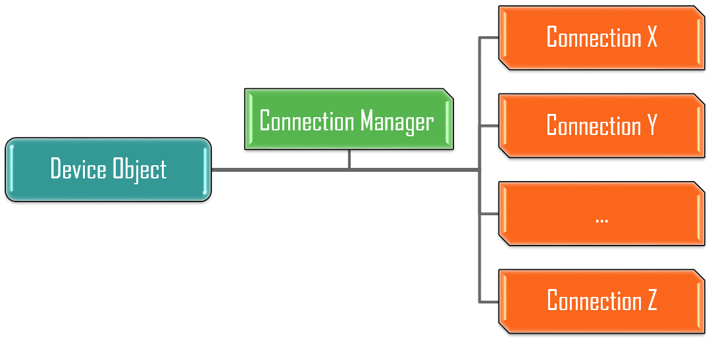

Introduction
============

.. sidebar:: Quick References

    - :ref:`Testbed Topology <testbed-index>`
    - `Paramiko`_
    - `Pexpect`_

.. _Paramiko: http://docs.paramiko.org/en/2.3/
.. _Pexpect: https://pexpect.readthedocs.org/en/stable/

There are *over nine thousand* known methods of communication: most of them
follow a typical, simplistic scheme where: a connection is first
established, and further conversation occurs through this connection. In such
scenarios, the connection can be often thought of as a pipeline, and the
conversations being the information and/or data that traverses through it.

The purpose of **Connections** module is to standardize the above communication
scheme: harmonize the look & feel of each connection implementation using
templates & base classes, and normalize the model that defines, binds &
manages these various connections to :ref:`topology_device_object`.

Conception
----------

Following object-oriented programming methodology, each independent connection,
regardless of its protocol (``telnet``/``ssh``/``HTTP``/``SNMP``) or technology
(``CLI``/``REST``/``YANG``), shall be modelled as a class object, where the
communication to and from this pipe is achieved through interaction with its
class methods.

Subsequently, all connections (eg: class object instances) to the same target
device shall be managed through a dedicated, high-level *manager* that provides
resource allocation, control & conflict management, and finally, seamless
integration to ``topology.Device`` object instances.

In effect, the connections module is a middleware, providing the basis to how
each connection type should be implemented, and interfacing between devices
these connection implementations. It features three primary classes:

ConnectionManager
    the behind-the-scene director that binds connections to ``topology.Device``
    objects. Each ``topology.Device`` instance is assigned its own
    ``ConnectionManager``, which controls all connections to the testbed
    device this object represents.

BaseConnection
    template class, providing the basis for various user imitations &
    implementations of an actual device connection (eg, telnet to console cli).

ConnectionPool
    connection-like implementation that allows users to create a "pool" of
    similar-type connections and share them in a multi-processing environment.

These classes are not intended to be invoked from the user script directly -
they work behind the scenes, governing script interactions and library
implementations.

Installation
------------

Connections module ``connections`` is installed by default as part of pyATS
installation. It is also a pre-requisite to installing ``topology`` module. This
package is featured on the PyPI server.

.. note::

    ``connections`` module is part of the ``pyats`` namespace, and therefore,
    users should always refer to the full namespace when installing & using it.

.. code-block:: bash

    pip install pyats.connections

To upgrade an existing installation of Connections package in your environment,
do:

.. code-block:: bash

    pip install pyats.connections --upgrade

.. note ::

    always read the :ref:`changelog` first before you upgrade.
