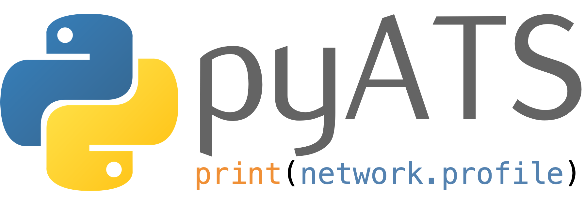

pyATS Documentation
===================

Welcome to pyATS documentation! Here you will find all there is to know about
the infrastructure, including user guides, api documentation, examples, case
studies and more.

-------------------------------------------------------------------------------

.. toctree::
    :maxdepth: 1
    :caption: Getting Started

    overview/index
    getting_started/index
    cli/index
    configuration/index

.. toctree::
    :maxdepth: 1
    :caption: Main Components

    aetest/index
    easypy/index
    topology/index
    kleenex/index
    connections/index

.. toctree::
    :maxdepth: 1
    :caption: Supporting Components

    async/index
    datastructures/index
    tcl/index
    log/index
    results/index
    reporter/index
    utilities/index
    robot/index
    manifest/index

.. toctree::
    :maxdepth: 1
    :caption: Resources

    terminology
    resources/index
    changelog/index

.. toctree::
    :maxdepth: 1
    :caption: API Doc

    apidoc/index
