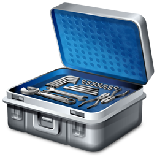

Overview
========

**pyATS** - Python Automated Test Systems is a Python3 based test automation
infrastructure. It is developed as the next-generation Cisco mainstream 
automation infrastructure, is compatible to existing tooling & infrastructure, 
and is officially endorsed by Cisco executive team. 

.. figure:: logo.png
    :align: center
    
pyATS is 100% fully developed and implemented using Python, and is designed 
to be usable *independent* of any other existing infrastructures. It is 
engineered to be suitable for Agile, rapid development iterations, 
with the ability to handle a wide variety of testing scenarios and requirements, 
from white-box unit-testing, to black-box, feature, performance/scale testing 
& beyond.

Analogy
-------

    
Consider pyATS as a toolbox, providing the nuts and bots, screwdrivers and power
tools, all made following a standard, metric system, required by everyone to 
build advanced machinery & robots with.

Not everyone envisions a robot to be the same: some thinks of a manufacturing
robot arm, and other thinks of Terminators like the T-800 model 101. Thus, pyATS
focuses on providing the most fundamental, common toolset needed by everyone. 
From there on, user's creations (modules, parts & etc) can be then assembled
together into fully functional end products.

    *"There's a difference between knowing the path, and walking the path."*
    - Morpheus

An Ecosystem
------------

Our goal is simple: redefine testing as a whole. This involves defining a whole
new *ecosystem* by studying and leveraging the fundamental properties of Python
language, thus creating new infrastructures and ways of doing most efficient &
effective for test engineering. 

    Ecosystem
        a complex network or interconnected system; A distributed, adaptive, 
        open socio-technical system with properties of self-organization, 
        scalability and sustainability.

pyATS is not a language clone or another look-alike of the existing test
infrastructure. Rather, it is an extraction of those finest ideas, designs and 
methods, interpolated to better reflect the demands of our community, 
with the infrastructure implemented from scratch, in a Pythonic, future-proof
fashion.

We strive for streamlines, aim for an environment where consistent, repeatable, 
iterative, and reusable tests are created, and empowers teams to make a
difference when possible.

Release to DevNet
-----------------

pyATS started its journey initially as an internal Cisco Engineering tool. Over 
the years, it amassed thousands of test developers and millions of lines of 
test scripts and libraries. As pyATS gathered momentum within Cisco, teams began
inquiring whether it’s possible to share their automation with customers as part
of collaborative development and release. 

As a result, pyATS has been made available externally to Cisco's end customers,
through DevNet. Today, pyATS is downloadable through Python PyPI:

    https://pypi.python.org/pypi/pyats

And you can visit our DevNet portal at https://developer.cisco.com/site/pyats/.
    
Vision: "Unified"
-----------------

* Agile software development methodology
* Pythonic infrastructure & object-oriented programming paradigm
* Sustains all Agile development team needs in a continuous integration
  environment.
* Easily share code/module/packages/scripts between teams
* Capable of leveraging existing tools and libraries
* Fully compatible with existing infrastructure
* Groundwork support for future languages
