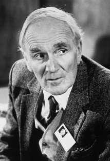

.. _tcl-q:

Q
=

In previous sections we covered how to natively access Tcl, read/set variables,
typecast variables, and making API calls. However, all of that was entirely
based on "evaluating" Tcl code in Python. That is: evaluating each line of Tcl
in its string format, and somehow typecasting the returning string back to 
Python objects.

There's a certain degree of frustration with that. Yes, it is natively Tcl, yes
it allows you to do anything and everything, but because the code to be 
evaluated is a string, when building the line, you must obey Python's string
formatting rules & use string substitution and such. 

The Quartermaster
-----------------

``tcl`` module offers a magic quartermaster function that allows users to make 
Tcl calls as if they were Python objects, allowing object attribute chaining and
support for mapping Python style arguments ``args`` and ``kwargs`` to Tcl's
positional and dashed argument styles.

    
    *A tribute to Desmond Llewelyn, Q from 1963 to 1999.*

The magic Q function is built-in to each ``Interpreter`` object instance and can
be accessed via either the ``q`` or ``Q`` attribute.

.. code-block:: python
    
    # Example
    # -------
    # 
    #   how to make fun of Q, 007 style.

    from pyats import tcl

    # create some procs/namespaces for use during this example
    tcl.eval('''
        # for testing casting
        keylset klist a "some value"
        keylset klist b "more values"
        keylset klist c.d.e "nested keys"

        # for testing positional arguments
        proc testPositionalArgs {a b c} {
            return [list $a $b $c]
        }

        # for testing dashed arguments
        proc testDashedArgs {args} {
            return $args
        }

        # for testing mixed style arguments
        proc testMixedArgs {a b args} {
            return [list $a $b $args]
        }

        # for nesting namespaces
        namespace eval ::a {
            namespace eval b {
                proc c {args} {
                    return $args
                }
            }
        }
    ''')

    # what is this... Q?
    tcl.q
    # <pyats.tcl.Q magic, referring Tcl code>

    # q is Q - the lowercase was only created to avoid pressing shift :)
    assert tcl.q is tcl.Q
    True

    # setting and getting variables
    tcl.q.set('myVar', 1)
    ret = tcl.q.set('myVar')

    # Q always performs a typecast (using Interpreter.cast_any) on the return
    tcl.q.set('myVar')
    1
    tcl.q.set('klist')
    KeyedList({'b': 'more values', 
               'c': KeyedList({
                    'd': KeyedList({
                        'e': 'nested keys'
                    })
                }), 
               'a': 'some value'})

    # calling namespace APIS
    # notice the chaining in arguments
    result = tcl.q.a.b.c()

    # calling with positional arguments
    tcl.q.testPositionalArgs("pos 1", "pos 2", "pos 3")
    # {pos 1} {pos 2} {pos 3} 

    # calling with kwargs: they get mapped to dashed args
    tcl.q.testDashedArgs(arg_a = 'a string', arg_b = 1, arg_c = 1)
    # -arg_a {a string} -arg_b 1 -arg_c 1

    # calling with mixed arguments
    tcl.q.testMixedargs('position 1', 
                        'position 2', 
                        arg_a = 'a string', arg_b = 1, arg_c = 1)
    # {position 1} {position 2} {-arg_b 1 -arg_c true -arg_a {a string}}

Regulations
-----------

The Q mechanism works by converting Python calls into specific Tcl syntax. The
following rules are followed:

* Q calls are relative to the current Tcl namespace (usually global ``::``). 
    
    .. code-block:: python
        
        # refer to Tcl's set command (built-in)
        tcl.q.set

* absolute namespaces in Tcl are represented as Q attribute chains.
    
    .. code-block:: python
        
        # refers to Tcl ::a::b::c procedure
        tcl.q.a.b.c

* call procedure as if you are making a Python call using ``()``.
    
    .. code-block:: python

        # making a call
        tcl.info('patchlevel')

* Python ``*args`` arguments are converted into Tcl positional arguments, 
  respecting the original argument position.
    
    .. code-block:: python
        
        # notice that set takes two arguments: name and value
        tcl.q.set('varName', 'varValue')

* Python ``**kwargs`` keyword arguments are converted into Tcl dashed arguments.
  Order is not preserved, as dashed arguments are not order-sensitive.
  
    .. code-block:: python
        
        # representation -a 1 -b 2 dashed arguments
        tcl.q.testProc(a = 1, b = 2)

* When ``*args`` and ``**kwargs`` are used together, positional arguments comes
  first, keywords/dashed arguments comes last.

* All arguments are converted from Python objects to Tcl string forms using
  ``tclstr`` casting API. See data casting section for details.

Auto-Cast
---------

By default, all Q function calls are always casted into Python objects using
``Interpreter.cast_any`` functionality. This allows maximum python-to-python
look & feels. This functionality can be turned off using ``cast_ = False`` 
argument.

.. code-block:: python
    
    # Example
    # -------
    #   Q casting on/off

    from pyats import tcl.

    tcl.eval('set myVar 1')

    # by default, Q casting is always on:
    type(tcl.q.set('myVar'))
    # <type 'int'>

    # turn it off using cast_ argument
    type(tcl.q.set('myVar', cast_ = False))
    # <type 'str'>

.. note::
    
    technically, ``cast_`` uses off a "potential" argument that can be sent to 
    the actual function called by Tcl. Thus, a trailing ``_`` is added in order
    to minimize the chance of such collisions. If you do actually find a case
    where a Tcl API has an argument named ``cast_``, please let us know.

Limitations
-----------

There are still some fundamental differences between Tcl and Python syntax, 
leading to corner conditions that cannot be handled even by the all-mighty Q.

* Python identifiers are limited to ``A-Z``, ``a-z``, ``0-9`` and ``_``. Thus,
  any procedure/namespace names with characters outside of this allowed set
  cannot be called with Q function. 

* Any Tcl procedure/namespaces with names the same as Python reserved keywords,
  statements and operators cannot be called. Eg: ``pass``, ``return``, ``def``.

.. code-block:: python

    # Example
    # -------
    #
    #   some example that cannot be called with Q

    from pyats import tcl

    tcl.eval('''
        proc procedureWith:Colon {} {}

        proc procedureWith-Dash {} {}

        namespace eval namespaceWith/\Slash {} {}

        # the null procedure
        proc {} {} {}
    ''')

    # try to call them
    tcl.q.procedureWith:Colon()
    #   File "<stdin>", line 1
    #     tcl.q.procedureWith:Colon()
    #                        ^
    # SyntaxError: invalid syntax

    tcl.q.procedureWith:Colon 
    # Traceback (most recent call last):
    #   File "<stdin>", line 1, in <module>
    # NameError: name 'Dash' is not defined

    tcl.namespaceWith/\Slash
    #   File "<stdin>", line 1
    #     tcl.namespaceWith/\Slash
    #                            ^
    # SyntaxError: unexpected character after line continuation character

    # and I honestly don't know how to call the null function in Python
    # ...

The only workaround for the above limitations is to continue using the basic
``Interpreter.eval()`` method, and evaluate them as strings.

.. code-block:: python

    # continuing from the above example ...

    tcl.eval('procedureWith:Colon')

    tcl.eval('procedureWith-Dash')

    tcl.eval('namespaceWith/\Slash')

    tcl.eval('{}')

.. hint::

    even though Tcl allows for special characters in procedure/namespace names,
    it is still considered extremely bad practice. Don't do it.

Examples
--------

Here's some practical day-to-day usage examples using Q magic.

.. code-block:: python
    
    # Example
    # -------
    # 
    #   some actual examples of how to abuse Q
    #   (don't forget to return his gadgets in a broken state)

    import os
    from pyats import tcl

    # source some files
    tcl.q.source(os.path.join('path','to','lib.tcl'))

    # delete an array element
    tcl.q.unset('myArray(index)')

    # list appends
    tcl.q.lappend('myList', 'value 1', 'value 2')

    # keyed list operations
    tcl.q.keylset('myKlist', 'key_a', 'value', 'key.subkey', 'value')

    # load up some packages
    tcl.q.package('require', 'Expect')

