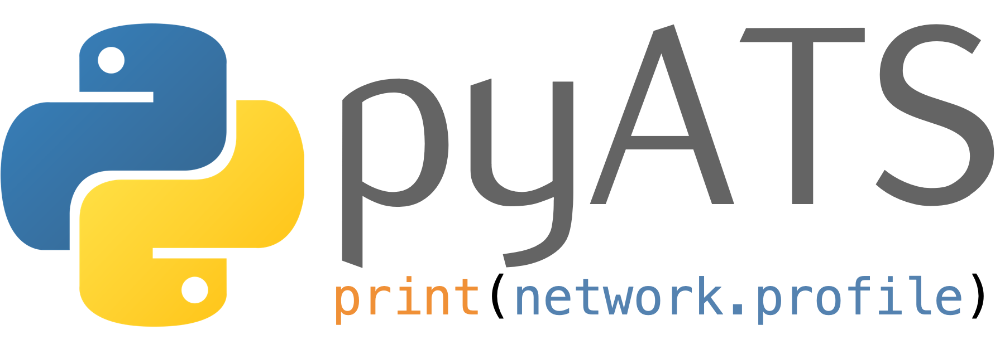

# pyATS Documentation

Welcome to the pyATS documentation! Here you will find all there is to know about
the infrastructure, including user guides, api documentation, examples, case
studies and more.

-------------------------------------------------------------------------------

## Getting Started

- [Overview](overview/index.md)
- [Getting Started](getting_started/index.md)
- [CLI](cli/index.md)
- [Configuration](configuration/index.md)

<!-- ## Main Components

- [Aereport](aereport/)
- [Aetest](aetest/)
- [Easypy](easypy/)
- [Topology](topology/)
- [Kleenex](kleenex/)
- [Connections](connections/)

## Supporting Components

- [Async](async/)
- [Datastructures](datastructures/)
- [Tcl](tcl/)
- [Log](log/)
- [Results](results/)
- [Reporter](reporter/)
- [Utilities](utilities/)
- [Robot](robot/)
- [Manifest](manifest/)

## Resources

- [Terminology](terminology.md)
- [Resources](resources/)
- [Changelog](changelog/)

## API Doc

- [API](apidoc/) -->
